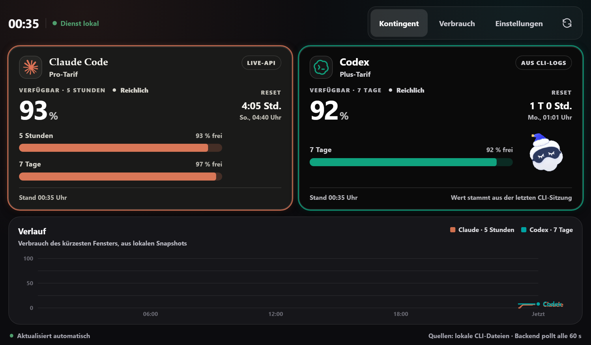
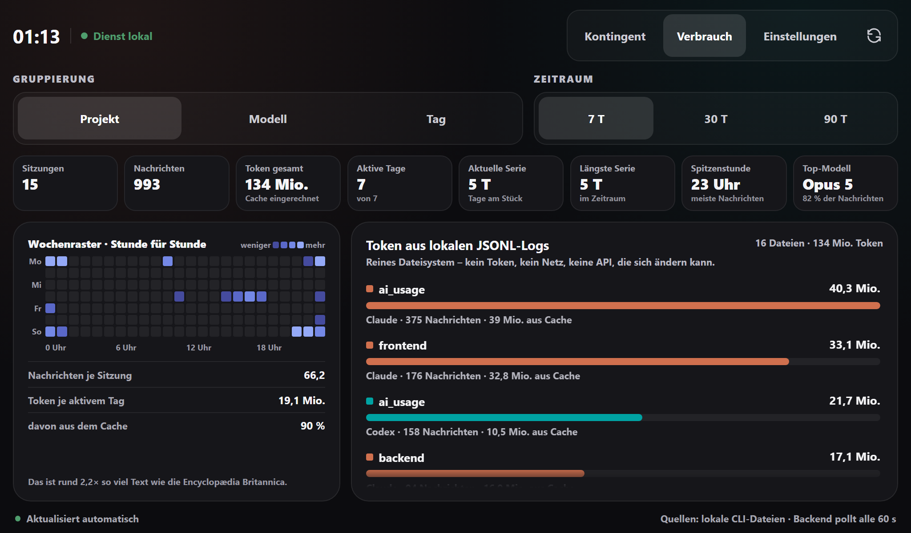
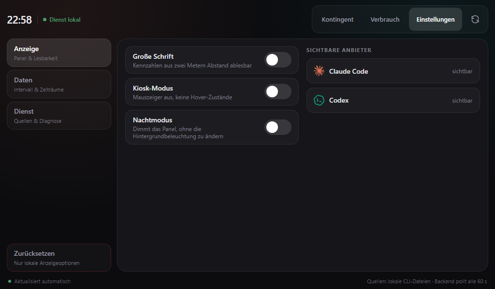

# NEXRON-TokenScope

Lokales Dashboard für die verbleibenden Kontingente von **Claude Code** und
**Codex**. Ein kleiner FastAPI-Dienst liest die Daten aus den Dateien, die
beide CLIs ohnehin auf der Platte halten, normalisiert sie und liefert sie
über eine eigene API aus. Das Vue-Frontend spricht ausschließlich mit diesem
Backend – nie direkt mit einem Anbieter, nie mit einem Token.

Zielgerät ist ein Raspberry Pi mit 7"-Touchdisplay (1024 × 600), der Betrieb
auf einem Desktop funktioniert genauso.



```text
┌──────────────┐        ┌─────────────────────────────┐
│ Vue-Frontend │  /api  │  FastAPI (nur 127.0.0.1)    │
│  1024 × 600  │ ─────▶ │  Poller · Cache · SQLite    │
└──────────────┘        └──────────────┬──────────────┘
                                       │
      ┌────────────────────────────────┼────────────────────────────────┐
      │                                │                                │
OAuth-Usage-Endpunkte      ~/.claude/projects/**.jsonl      ~/.codex/sessions/**.jsonl
(Restkontingent, Reset)    (Verbrauch je Projekt/Modell)    (Verbrauch + rate_limits)
```

## Schnellstart

```bash
git clone https://github.com/nexron-studios/nexron-TokenScope.git
cd nexron-TokenScope
./start.sh        # Windows: .\start.ps1
```

Voraussetzungen: **Python 3.10+**, **Node.js 22+** und mindestens eine
angemeldete CLI (Claude Code oder Codex). Der erste Lauf richtet venv,
npm-Pakete und Frontend-Build selbst ein und dauert ein paar Minuten; jeder
weitere startet in Sekunden. Danach läuft alles unter
<http://127.0.0.1:8787/> – **ein Prozess, ein Port**. Beenden mit
<kbd>Strg</kbd>+<kbd>C</kbd>.

| Option | Wirkung |
| --- | --- |
| `-Dev` / `--dev` | zusätzlich Vite-Dev-Server mit Hot-Reload auf Port 5173 |
| `-NoBrowser` | Browser nicht automatisch öffnen |
| `-Port 9000` / `NEXRON_TOKENSCOPE_PORT=9000` | anderer Port |
| `-Desktop` (nur `start.ps1`) | statt im Browser im eigenen Fenster im Vollbild |
| `-Monitor smallest` / `4` / `DISPLAY4` (nur `start.ps1`) | auf welchem Bildschirm das Fenster aufgeht |
| `-ListMonitors` (nur `start.ps1`) | zeigt die Bildschirme mit ihrer Nummer |
| `--kiosk` (nur `start.sh`) | Chromium danach im Vollbild starten |

Direkteinstieg in eine Ansicht über den Hash: `#verbrauch`, `#einstellungen`.

### Ohne Anmeldedaten ansehen

```bash
NEXRON_TOKENSCOPE_DEMO_MODE=1 ./start.sh
```

Unter PowerShell: `$env:NEXRON_TOKENSCOPE_DEMO_MODE = 1; .\start.ps1`. Die
Werte sind dann simuliert und in der Oberfläche als **Demo** gekennzeichnet.

### Läuft es?

```bash
curl http://127.0.0.1:8787/api/health
```

`sources` zeigt, welche der vier Quellen gefunden wurden. Steht dort überall
`false`, hat der Dienst die CLI-Dateien nicht gefunden – dann helfen die
`NEXRON_TOKENSCOPE_*_PATH`-Variablen aus der [Konfiguration](#konfiguration).
Dieselbe Übersicht steht in der Oberfläche unter **Einstellungen → Dienst**.

<details>
<summary>Von Hand, ohne Skript</summary>

```bash
cd backend
python3 -m venv .venv                  # Windows: py -m venv .venv
.venv/bin/pip install -r requirements.txt
PYTHONPATH=. .venv/bin/python -m uvicorn app.main:app --host 127.0.0.1 --port 8787
```

```bash
cd frontend && npm install
npm run build          # dist/ – wird vom Backend ausgeliefert
npm run dev            # http://127.0.0.1:5173, /api wird auf 8787 geproxyt
```

`npm run dev` startet nur das Frontend; das Backend muss daneben laufen, sonst
meldet die Oberfläche *Kein Backend erreichbar*. Wer am Backend arbeitet, hängt
`--reload` an den uvicorn-Aufruf – die Startskripte tun das bewusst nicht, weil
das Panel im Dauerbetrieb keinen Dateiwächter braucht.

</details>

## Woher die Daten kommen

| Frage | Quelle | Robustheit |
| --- | --- | --- |
| Wie viel Kontingent ist noch übrig, wann ist Reset? | OAuth-Usage-Endpunkt | undokumentiert, kann sich ändern |
| Wie viel habe ich diese Woche pro Projekt/Modell verbraucht? | lokale JSONL-Logs | reines Dateisystem, kein Auth, kein Netz |
| Was, wenn der Endpunkt ausfällt? | frische `rate_limits` aus den Codex-Rollout-Logs | aktuelle Momentaufnahme eines aktiven Chats; ältere Werte werden verworfen |

**Tokens** werden bei jedem Poll frisch eingelesen, weil die CLIs sie laufend
erneuern: Keychain-Eintrag `Claude Code-credentials` (macOS) bzw.
`~/.claude/.credentials.json`, für Codex `~/.codex/auth.json`.

Einen abgelaufenen Token erneuert der Dienst **nie selbst** – er liest keinen
`refresh_token` und schreibt nichts in die Credentials. Erneuern darf nur, wer
den Token ausgestellt hat. Also stößt er die CLI mit einem kurzen, nicht
interaktiven Kommando an (`claude auth status`) und prüft am nächsten Abruf, ob
das geholfen hat; das Ergebnis steht als `cli.refresh_recovered` bzw.
`cli.refresh_ineffective` im Log. Höchstens ein Versuch alle fünf Minuten.
Ändert sich die Credential-Datei, wird sofort neu abgefragt, statt das Intervall
abzuwarten – wer die CLI ohnehin von Hand startet, sieht den frischen Stand also
binnen Sekunden.

**Endpunkte** sind `api.anthropic.com/api/oauth/usage` und
`chatgpt.com/backend-api/codex/usage`. Beide URLs lassen sich über
`NEXRON_TOKENSCOPE_CLAUDE_USAGE_URL` bzw. `…_CODEX_USAGE_URL` nachziehen –
ändert ein Anbieter seine Route, reicht eine Zeile in der `.env`.

Die **JSONL-Auswertung** streamt zeilenweise, cacht je Datei über
`mtime`/`size` und dedupliziert: Claude über `message.id` + `requestId`, Codex
über Differenzen der kumulativen `total_token_usage` statt über Summen. Beim
Abruf wird nur die laufende Sitzung neu gelesen, nicht die ganze Historie.

### Wenn ein Abruf scheitert

Ein einzelner fehlgeschlagener Poll leert keine Kachel: Der Dienst behält den
letzten geglückten Abruf, liefert ihn mit `stale: true` plus `warning` weiter,
und die Oberfläche zeigt **Letzter Stand** samt Grund und ursprünglichem
Zeitstempel. Beim nächsten geglückten Abruf löst sich das von allein.
Überbrückte Werte landen **nicht** in der Historie, sonst würde der Verlauf zu
einer erfundenen Geraden. Meldet ein Anbieter `429`, pausiert der Dienst genau
diesen Anbieter – so lange wie `Retry-After` verlangt, sonst 5 Minuten
(maximal 30).

Jeder Anbieter wird einzeln abgesichert abgefragt: Ein kaputter Endpunkt leert
genau eine Kachel, nie das ganze Dashboard. Der `status` sagt, warum
(`auth_missing`, `auth_expired`, `unauthorized`, `rate_limited`, `unreachable`,
`unexpected_shape`), der `source`, woher der Wert stammt (`api`, `logs`, `cli`,
`demo`).

## API

| Route | Zweck |
| --- | --- |
| `GET /api/usage` | aktueller Cache; `?refresh=true` erzwingt einen Poll |
| `GET /api/history?hours=24[&provider=]` | Snapshot-Verlauf aus SQLite |
| `GET /api/logs/summary?days=7&group_by=day\|project\|model\|provider` | Auswertung der JSONL-Logs samt Kennzahlen (`insights`) |
| `GET /api/health` | Diagnose: gefundene Quellen, letzter Poll, Bindung |

Schema und Beispielantworten stehen interaktiv unter
<http://127.0.0.1:8787/docs>.

## Oberfläche

Das Layout ist auf **1024 × 600** ausgelegt: Die Seite selbst scrollt nie, nur
einzelne Flächen im Inneren. Touch-Ziele sind mindestens 48 px hoch, statt
nativer Dropdowns kommen segmentierte Schalter zum Einsatz – ein `<select>` ist
auf einem kapazitiven 7"-Panel kaum treffsicher bedienbar. Jede Kachel trägt
die Anmutung ihres Anbieters; Zustände (*Reichlich* / *Wird knapp* /
*Kritisch*) tragen immer Symbol **und** Text, nie nur Farbe.

Drei Ansichten:

- **Kontingent** – Restkontingent je Fenster, Reset-Countdown, Verlaufschart
- **Verbrauch** – Kennzahlen, Wochenraster und Token aus den JSONL-Logs,
  gruppiert nach Projekt, Modell oder Tag
- **Einstellungen** – Anzeige (Nachtmodus, Sprache, Fenstergröße), Daten
  (Intervall, Zeiträume), Dienst (gefundene Quellen, letzter Poll, Bindung)

**Fenstergröße** setzt das Fenster der Desktop-Hülle auf 1024 × 640, 1280 × 800
oder 1600 × 1000. Im Browser ist die Stufe nur gespeichert – dort bestimmt der
Browser die Größe. Läuft das Fenster im Vollbild, führt eine Auswahl heraus; ein
Kiosk-Start im Vollbild bleibt davon unberührt.





Projektnamen werden über beide Quellen hinweg vereinheitlicht: Claude legt
Ordner mit slugifiziertem Pfad an (`c--me-dev-projects-nexron-tokenscope`),
Codex nennt das echte Arbeitsverzeichnis (`nexron-TokenScope`) – ohne
Normalisierung stünde dasselbe Projekt zweimal in der Auswertung. Modell-IDs
werden nur nach bekannten Mustern gekürzt (`claude-opus-4-5-20251101` →
*Opus 4.5*); was nicht passt, steht unverändert da.

Neben den Balken läuft je Kachel eine kleine Figur: **Clawd** bei Claude,
**Cloudling** bei Codex. Sie zeigt den Zustand mit – Störung, Drosselung,
knappes Kontingent – und wird sonst nach Tageszeit gewichtet gezogen. Die Clips
liegen in [`frontend/src/assets/animations/`](frontend/src/assets/animations/),
die Zuordnung samt Laufzeiten in
[`frontend/src/theme/mascot.ts`](frontend/src/theme/mascot.ts): **Tauschst du
eine Datei, passe die Laufzeit mit an.** Bei `prefers-reduced-motion` entfällt
der Begleiter ganz. Die Sprites stehen unter **AGPL-3.0**, nicht unter MIT –
siehe [Lizenz](#lizenz).

## Konfiguration

Alles über Umgebungsvariablen mit dem Präfix `NEXRON_TOKENSCOPE_` oder über
`backend/.env` (Vorlage: [`backend/.env.example`](backend/.env.example)).
**Keine Tokens eintragen** – die kommen bei jedem Poll aus den CLI-Dateien.

| Variable | Vorgabe | Zweck |
| --- | --- | --- |
| `NEXRON_TOKENSCOPE_HOST` / `NEXRON_TOKENSCOPE_PORT` | `127.0.0.1` / `8787` | Bindung. Alles außer Loopback macht die Tokens im Netz nutzbar. |
| `NEXRON_TOKENSCOPE_POLL_INTERVAL_SECONDS` | `60` | Abstand zwischen zwei Abfragen |
| `NEXRON_TOKENSCOPE_DEMO_MODE` | `0` | Simulierte Werte ohne Credentials |
| `NEXRON_TOKENSCOPE_MAX_BRIDGE_MINUTES` | `30` | wie frisch ein Codex-Log sein muss, um als aktueller statt letzter Stand zu gelten |
| `NEXRON_TOKENSCOPE_CLAUDE_CLI_REFRESH_COMMAND` | `["claude","auth","status"]` | Kommando, das bei abgelaufenem Token die CLI anstößt. Leere Liste schaltet es ab. |
| `NEXRON_TOKENSCOPE_CODEX_CLI_REFRESH_COMMAND` | `[]` | dasselbe für Codex – bewusst leer, siehe unten |
| `NEXRON_TOKENSCOPE_CLI_REFRESH_MIN_INTERVAL_SECONDS` | `300` | Mindestabstand zwischen zwei Anstößen je Anbieter |
| `NEXRON_TOKENSCOPE_CLAUDE_USAGE_URL` / `…_CODEX_USAGE_URL` | Anbieter-Routen | nachziehbar, wenn sich eine Route ändert |
| `NEXRON_TOKENSCOPE_CLAUDE_CREDENTIALS_PATH` / `…_CODEX_AUTH_PATH` | `~/.claude/.credentials.json` / `~/.codex/auth.json` | abweichender Ort der Anmeldedaten |
| `NEXRON_TOKENSCOPE_CLAUDE_PROJECTS_DIR` / `…_CODEX_SESSIONS_DIR` | `~/.claude/projects` / `~/.codex/sessions` | Wurzel der Sitzungslogs |
| `NEXRON_TOKENSCOPE_CODEX_LOG_FALLBACK` | `1` | `rate_limits` aus den Rollout-Logs, wenn die API schweigt |
| `NEXRON_TOKENSCOPE_CODEX_CLI_FALLBACK` | `0` | zusätzlich `npx codex-check --json` versuchen |
| `NEXRON_TOKENSCOPE_HISTORY_ENABLED` / `…_HISTORY_RETENTION_DAYS` | `1` / `90` | Snapshots nach SQLite schreiben, ältere täglich entfernen |
| `NEXRON_TOKENSCOPE_CLAUDE_ENABLED` / `…_CODEX_ENABLED` | `1` | Anbieter serverseitig abschalten |

## Wenn etwas nicht geht

**Einstellungen → Dienst** zeigt, welche Quellen gefunden wurden, wann zuletzt
gepollt wurde und ob der Dienst wirklich nur auf Loopback hört. Dieselben
Angaben liefert `GET /api/health`.

| Symptom | Ursache | Abhilfe |
| --- | --- | --- |
| Beide Kacheln bleiben leer | Keine CLI angemeldet – es gibt nichts zu lesen | Claude Code bzw. Codex einmal starten und anmelden |
| *py … / npm … nicht gefunden* | Python oder Node fehlen im `PATH` | Python 3.10+ und Node.js 22+ installieren, Terminal neu öffnen |
| *Token wurde abgelehnt* (`unauthorized`) | Der Endpunkt lehnt den Token ab, und es gibt keine frischen lokalen Werte | CLI einmal starten; frische Codex-`rate_limits` aus einem aktiven Chat werden verwendet, alte Logdaten nicht |
| *Anbieter drosselt gerade* (`rate_limited`) | Zu viele Anfragen | Der Dienst pausiert automatisch; dauerhaft `…_POLL_INTERVAL_SECONDS` erhöhen |
| *Keine Anmeldedaten gefunden* (`auth_missing`) | Pfad weicht ab, oder die CLI schreibt die Datei gerade neu | Pfad über `NEXRON_TOKENSCOPE_*_PATH` setzen; bei Token-Refresh löst es sich beim nächsten Poll |
| *Token abgelaufen* (`auth_expired`) | Der Zugriffstoken ist abgelaufen – typisch nach dem Hochfahren, er gilt nur wenige Stunden | Der Dienst stößt die Claude-CLI selbst an und schreibt ins Log, ob es geholfen hat (`cli.refresh_recovered` / `cli.refresh_ineffective`). Steht dort dauerhaft `ineffective`, die CLI einmal von Hand starten und ein anderes Kommando setzen |
| *Format hat sich geändert* (`unexpected_shape`) | Der Endpunkt liefert neue Feldnamen | URL prüfen; die JSONL-Auswertung läuft davon unberührt weiter |
| Verlaufschart bleibt leer | Es gibt noch keine Snapshots | Füllt sich mit jedem Poll |
| *Kein Backend erreichbar* | Backend läuft nicht oder auf anderem Port | Backend starten; im Dev-Betrieb `VITE_BACKEND_URL` setzen |

## Dauerbetrieb

<details>
<summary>Desktop-Fenster auf einem eigenen Bildschirm (Windows)</summary>

```powershell
.\start.ps1 -Desktop -Monitor smallest
```

Unter [`desktop/`](desktop/) liegt eine schlanke
[Tauri](https://tauri.app)-Hülle. Sie rendert nichts eigenes: Sie startet bei
Bedarf das Backend und zeigt dessen Oberfläche im Vollbild. Läuft der Dienst
schon, hängt sie sich an ihn an.

Die Reihenfolge der Bildschirme legt Windows fest und ändert sich beim An- und
Abstecken – robuster als eine Nummer sind `smallest` / `largest` oder ein Stück
des Gerätenamens (`-Monitor DISPLAY4`). `.\start.ps1 -ListMonitors` zeigt alle.

Der erste Lauf baut die Hülle mit `cargo`; das dauert einige Minuten und
braucht [Rust](https://rustup.rs). <kbd>F11</kbd> schaltet den Vollbildmodus
um, <kbd>Esc</kbd> führt heraus, <kbd>Alt</kbd>+<kbd>F4</kbd> beendet.

Die gebaute `nexron-tokenscope-desktop.exe` lässt sich auch direkt verknüpfen
(Argumente `--monitor`, `--port`, `--windowed`, `--on-top`, `--root`,
`--no-backend`, `--list-monitors`; jeweils auch als
`NEXRON_TOKENSCOPE_DESKTOP_*`-Variable). Sie baut das Frontend nicht selbst –
nach Änderungen unter `frontend/src` einmal `npm run build` laufen lassen. Ihr
Startverlauf steht in
`%LOCALAPPDATA%\com.nexron.tokenscope\logs\desktop.log`.

</details>

<details>
<summary>Auf dem Pi, als systemd-Dienst</summary>

```bash
./start.sh --kiosk
```

```ini
[Unit]
Description=NEXRON-TokenScope (lokal)
After=network.target

[Service]
User=pi
WorkingDirectory=/home/pi/nexron-TokenScope
ExecStart=/home/pi/nexron-TokenScope/start.sh
Restart=on-failure

[Install]
WantedBy=default.target
```

Ablegen unter `~/.config/systemd/user/nexron-tokenscope.service`, dann
`systemctl --user enable --now nexron-tokenscope`.

</details>

## Sicherheit

> [!WARNING]
> Die gelesenen Tokens sind vollwertige Account-Credentials. Nichts davon
> gehört auf einen öffentlichen Server oder ins Repository.

- Der Dienst bindet standardmäßig auf `127.0.0.1`. Ein anderer Wert wird beim
  Start als Warnung geloggt und in den Einstellungen sichtbar gemacht.
- Tokens werden nie gespeichert, nie geloggt und nie an das Frontend gegeben.
  `Credential.__repr__` ist redigiert, Fehlermeldungen werden vor dem Loggen
  von Tokenmaterial befreit.
- `backend/data/` (SQLite-Snapshots) und `.env` sind gitignored. Die Snapshots
  enthalten nur Prozentwerte und Zeitstempel.
- Das Frontend speichert ausschließlich Anzeigeoptionen unter
  `nexron-tokenscope:settings` im Local Storage.

## Struktur

```text
backend/app/
├── config.py           Einstellungen (NEXRON_TOKENSCOPE_*)
├── credentials.py      Token frisch einlesen, redigiert
├── normalize.py        toleranter Parser für unbekannte Feldnamen
├── poller.py           Poll-Schleife, Cache, Fehlerisolierung
├── storage.py          SQLite-Snapshots
├── api.py · main.py    /api/* · App, Lifespan, statisches Frontend
├── providers/          base · claude_api · codex_api · demo
└── logs/               records · claude_jsonl · codex_jsonl · aggregate

frontend/src/
├── api/                Client + Typen des eigenen Backends
├── theme/              brands · models · mascot
├── composables/        useUsage · useHistory · useSettings · …
├── components/         ProviderCard · UsageMeter · ProviderMascot · …
├── views/              Dashboard · Logs · Settings
└── assets/             main.css · logos/ · animations/
```

## Einschränkung

Beide Usage-Endpunkte sind undokumentiert und können sich jederzeit ändern.
Der Parser ist darauf ausgelegt: Er sucht Prozent- und Reset-Felder unter
mehreren gängigen Namen, akzeptiert ISO-Zeitstempel wie Unix-Sekunden und
meldet `unexpected_shape` statt zu raten. Die JSONL-Auswertung bleibt davon
unberührt – sie liest nur Dateien.

Die Codex-Route ist die unsicherste Annahme im Projekt: Ein abgelaufener Token
und eine falsche Route antworten beide mit `401`, das lässt sich von außen
nicht unterscheiden. Solange das offen ist, trägt die Kachel den Wert aus den
Rollout-Logs und weist ihn als solchen aus.

## Lizenz

Der Code steht unter MIT – siehe [LICENSE](LICENSE).

**Nicht der Ordner `frontend/src/assets/animations/`.** Die Clawd- und
Cloudling-Sprites stammen aus
[clawd-on-desk](https://github.com/rullerzhou-afk/clawd-on-desk) und stehen
unter AGPL-3.0. Wer dieses Projekt samt Sprites weitergibt oder über ein Netz
zugänglich macht, müsste das Ganze unter AGPL-3.0 stellen. Solange es auf dem
eigenen Panel im eigenen Netz läuft, ist das folgenlos; vor einer
Veröffentlichung wären die Möglichkeiten: Sprites herausnehmen, ersetzen, oder
das Projekt auf AGPL-3.0 umstellen.
