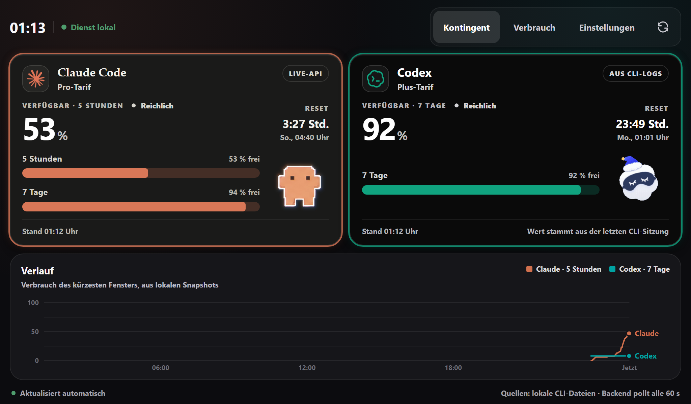

# AI Usage Monitor

Lokales Dashboard für die verbleibenden Kontingente von **Claude Code** und
**Codex**. Ein kleiner FastAPI-Dienst liest die Daten aus den Dateien, die
beide CLIs ohnehin auf der Platte halten, normalisiert sie und liefert sie
über eine eigene API aus. Das Vue-Frontend spricht ausschließlich mit diesem
Backend – nie direkt mit einem Anbieter, nie mit einem Token.

Zielgerät ist ein Raspberry Pi mit 7"-Touchdisplay (1024 × 600), der Betrieb
auf einem Desktop funktioniert genauso.


```text
┌──────────────┐        ┌─────────────────────────────┐
│  Vue-Kiosk   │  /api  │  FastAPI (nur 127.0.0.1)    │
│  1024 × 600  │ ─────▶ │  Poller · Cache · SQLite    │
└──────────────┘        └──────────────┬──────────────┘
                                       │
      ┌────────────────────────────────┼────────────────────────────────┐
      │                                │                                │
OAuth-Usage-Endpunkte      ~/.claude/projects/**.jsonl      ~/.codex/sessions/**.jsonl
(Restkontingent, Reset)    (Verbrauch je Projekt/Modell)    (Verbrauch + rate_limits)
```

**Schnellstart** – Voraussetzungen und Details unter [Loslegen](#loslegen):

```bash
git clone https://github.com/addictedsociety/ai_usage.git
cd ai_usage
./start.sh        # Windows: .\start.ps1
```

## Woher die Daten kommen

| Frage | Quelle | Robustheit |
| --- | --- | --- |
| Wie viel Kontingent ist noch übrig, wann ist Reset? | OAuth-Usage-Endpunkt | undokumentiert, kann sich ändern |
| Wie viel habe ich diese Woche pro Projekt/Modell verbraucht? | lokale JSONL-Logs | reines Dateisystem, kein Auth, kein Netz |
| Was, wenn der Endpunkt ausfällt? | letzte `rate_limits` aus den Codex-Rollout-Logs | Momentaufnahme der letzten CLI-Sitzung |

### Token

Bei **jedem** Poll frisch eingelesen, weil die CLIs sie laufend erneuern:

- **Claude:** Keychain-Eintrag `Claude Code-credentials` (macOS), sonst
  `~/.claude/.credentials.json` → `claudeAiOauth.accessToken`
- **Codex:** `~/.codex/auth.json` → `tokens.access_token` + `tokens.account_id`

### Endpunkte

- **Claude:** `GET https://api.anthropic.com/api/oauth/usage`
  mit `Authorization: Bearer …` und `anthropic-beta: oauth-2025-04-20`
- **Codex:** `GET https://chatgpt.com/backend-api/codex/usage`
  mit `Authorization: Bearer …` und `chatgpt-account-id: …`

Beide URLs sind über `AIUSAGE_CLAUDE_USAGE_URL` bzw. `AIUSAGE_CODEX_USAGE_URL`
konfigurierbar – ändert ein Anbieter seine Route, reicht eine Zeile in der
`.env` statt eines Code-Umbaus. Optional lässt sich `npx codex-check --json`
als zweiter Notnagel aktivieren (`AIUSAGE_CODEX_CLI_FALLBACK=1`).

### Was JSONL hier bringt

JSON Lines heißt: **pro Zeile ein vollständiges JSON-Objekt**, kein
umschließendes Array. Der Parser streamt zeilenweise, die Datei landet nie
komplett im RAM, neue Einträge werden nur angehängt, und eine halb
geschriebene Zeile der gerade laufenden Sitzung macht nicht die ganze Datei
unlesbar – sie wird gezählt und übersprungen.

Deduplizierung:

- **Claude** schreibt dieselbe Nachricht teils mehrfach (Retries, Sidechains).
  Schlüssel ist `message.id` + `requestId`.
- **Codex** meldet in `token_count`-Events ein *kumulatives*
  `total_token_usage`. Der Parser bildet Differenzen statt zu summieren – das
  ist immun gegen doppelte Events und gegen verpasste Turns.

Pro Datei wird das Ergebnis über `mtime`/`size` gecacht: Beim Abruf wird nur
die gerade laufende Sitzung neu gelesen, nicht die ganze Historie.

## Normalisierung

Beide Antwortformate landen in einem Schema. Fehlt ein Feld oder ändert sich
ein Name, verschwindet nur das betroffene Fenster – nicht die ganze Antwort:

```json
{
  "generated_at": "2026-08-02T19:33:38Z",
  "poll_interval_seconds": 60,
  "providers": [
    {
      "id": "claude",
      "plan": "Pro",
      "source": "api",
      "status": "ok",
      "windows": [
        {
          "key": "five_hour",
          "label": "5 Stunden",
          "used_percent": 30.0,
          "remaining_percent": 70.0,
          "resets_at": "2026-08-02T23:59:59Z",
          "window_minutes": 300,
          "primary": true
        }
      ]
    }
  ]
}
```

Jeder Anbieter wird einzeln abgesichert abgefragt: Ein kaputter Endpunkt leert
genau eine Kachel, nie das ganze Dashboard. Der `status` sagt, warum
(`auth_missing`, `auth_expired`, `unauthorized`, `rate_limited`,
`unreachable`, `unexpected_shape`), der `source`, woher der Wert stammt
(`api`, `logs`, `cli`, `demo`).

### Welche Fenster angezeigt werden

Der Claude-Endpunkt liefert neben den echten Limits gelegentlich Buckets unter
internen Codenamen – etwa `nimbus_quill` –, die weder Fenstergröße noch Reset
melden. Angezeigt werden deshalb nur die benannten Fenster (`five_hour`,
`seven_day` und dessen Varianten, siehe `_DISPLAY_KEYS` in
`providers/claude_api.py`).

Der Filter greift aber nur, **solange danach etwas übrig bleibt**. Benennt der
Anbieter eines Tages `five_hour` um, würde eine harte Liste alle Fenster
verschlucken und die Kachel liefe in den Leerzustand. Stattdessen fällt sie auf
die Rohfenster zurück – dann stehen wieder Codenamen in der Oberfläche, und das
ist genau das gewünschte Signal, dass sich das Format geändert hat.

### Aussetzer überbrücken

Ein einzelner fehlgeschlagener Poll leert keine Kachel. Der Dienst behält den
letzten geglückten Abruf je Anbieter und liefert ihn mit `stale: true` plus
`warning` weiter – die Oberfläche zeigt dann das Abzeichen **Gehalten** und
den Grund in der Fußzeile, die Werte bleiben lesbar.

Der Zustand löst sich von allein: Beim nächsten geglückten Abruf ersetzt der
frische Wert den gehaltenen, das Abzeichen verschwindet. Damit daraus kein
falsches Bild wird, greifen drei Grenzen:

- Fenster, deren `resets_at` inzwischen verstrichen ist, fallen weg – ihr Wert
  wäre nachweislich falsch. Bleibt keins übrig, zeigt die Kachel ehrlich nichts.
- Nach `AIUSAGE_MAX_BRIDGE_MINUTES` (Vorgabe 30) wird gar nicht mehr
  überbrückt. Ohne diese Grenze stünde bei dauerhaft kaputtem Token tagelang
  ein überholter Wert des 7-Tage-Fensters in der Kachel, weil dessen Reset noch
  weit weg ist – das kurze 5-Stunden-Fenster räumt sich dagegen selbst ab.
- Überbrückte Werte werden **nicht** in die Historie geschrieben, sonst würde
  der Verlauf zu einer erfundenen Geraden.

Beim Start holt sich der Poller den letzten Stand aus SQLite zurück – ebenfalls
nur innerhalb der Überbrückungsgrenze –, sonst stünde nach jedem Neustart
wieder eine leere Kachel da.

Meldet ein Anbieter `429`, pausiert der Dienst genau diesen Anbieter – so lange
wie `Retry-After` verlangt, sonst 5 Minuten (maximal 30). Stures Weiterpollen
verlängert eine Drosselung nur.

## API

| Route | Zweck |
| --- | --- |
| `GET /api/usage` | aktueller Cache; `?refresh=true` erzwingt einen Poll |
| `GET /api/history?hours=24[&provider=]` | Snapshot-Verlauf aus SQLite |
| `GET /api/logs/summary?days=7&group_by=day\|project\|model\|provider` | Auswertung der JSONL-Logs samt Kennzahlen (`insights`) |
| `GET /api/health` | Diagnose: gefundene Quellen, letzter Poll, Bindung |

Interaktive Doku: <http://127.0.0.1:8787/docs>

## Loslegen

### Was du brauchst

| Voraussetzung | wofür |
| --- | --- |
| **Python 3.10+** | Backend |
| **Node.js 22+** | Frontend-Build |
| **Git** | zum Klonen |
| **Claude Code** und/oder **Codex CLI**, jeweils **angemeldet** | die Datenquelle |

Der Monitor erfindet nichts und meldet sich nirgends an: Er liest die
Anmeldedaten und Sitzungslogs, die die CLIs ohnehin auf der Platte ablegen.
Ohne mindestens eine angemeldete CLI bleiben die Kacheln deshalb leer – zum
Ansehen gibt es den [Demo-Modus](#nur-ansehen-ohne-anmeldedaten). Beide
Anbieter sind optional; wer nur eine CLI nutzt, schaltet die andere über
`AIUSAGE_CODEX_ENABLED=0` bzw. `AIUSAGE_CLAUDE_ENABLED=0` ab.

### Holen und starten

```bash
git clone https://github.com/addictedsociety/ai_usage.git
cd ai_usage
```

```powershell
.\start.ps1          # Windows
```

```bash
chmod +x start.sh    # einmalig, falls das Ausführungsrecht fehlt
./start.sh           # Linux / macOS / Raspberry Pi
```

Das Skript richtet beim ersten Lauf alles selbst ein – virtuelle Umgebung,
npm-Pakete, Frontend-Build – und startet danach das Backend, das das gebaute
Frontend gleich mit ausliefert. **Ein Prozess, ein Port.** Der Browser öffnet
sich, sobald der Dienst antwortet. Später baut es nur neu, wenn sich unter
`frontend/src/` wirklich etwas geändert hat.

| Option | Wirkung |
| --- | --- |
| `-Dev` / `--dev` | zusätzlich Vite-Dev-Server mit Hot-Reload auf Port 5173 |
| `-NoBrowser` | Browser nicht automatisch öffnen |
| `-Port 9000` / `AIUSAGE_PORT=9000` | anderer Port |
| `-Desktop` (nur `start.ps1`) | statt im Browser im eigenen Fenster im Vollbild |
| `-Monitor smallest` / `4` / `DISPLAY4` (nur `start.ps1`) | auf welchem Bildschirm das Fenster aufgeht |
| `-ListMonitors` (nur `start.ps1`) | zeigt die Bildschirme mit ihrer Nummer |
| `--kiosk` (nur `start.sh`) | Chromium danach im Vollbild starten |

Beenden mit <kbd>Strg</kbd>+<kbd>C</kbd>. Direkteinstieg in eine Ansicht über
den Hash: `#verbrauch`, `#einstellungen`.

Der erste Lauf dauert ein paar Minuten – venv anlegen, npm-Pakete laden,
Frontend bauen. Jeder weitere startet in Sekunden.

### Läuft es?

```bash
curl http://127.0.0.1:8787/api/health
```

`sources` zeigt, welche der vier Quellen gefunden wurden. Steht dort überall
`false`, hat der Dienst die CLI-Dateien nicht gefunden – dann helfen die
`AIUSAGE_*_PATH`-Variablen aus der [Konfiguration](#konfiguration). Dieselbe
Übersicht steht in der Oberfläche unter **Einstellungen → Dienst**.

### Nur ansehen, ohne Anmeldedaten

```bash
AIUSAGE_DEMO_MODE=1 ./start.sh
```

```powershell
$env:AIUSAGE_DEMO_MODE = 1; .\start.ps1
```

Die Werte sind dann simuliert und in der Oberfläche sichtbar als **Demo**
gekennzeichnet. Praktisch, um die Oberfläche anzusehen oder daran zu
entwickeln, ohne eine CLI anzumelden.

<details>
<summary>Von Hand, ohne Skript</summary>

```powershell
# Backend
cd backend
py -m venv .venv
.\.venv\Scripts\pip.exe install -r requirements.txt
$env:PYTHONPATH = (Get-Location).Path
.\.venv\Scripts\python.exe -m uvicorn app.main:app --host 127.0.0.1 --port 8787
```

```bash
# Backend (Linux/macOS)
cd backend
python3 -m venv .venv
.venv/bin/pip install -r requirements.txt
PYTHONPATH=. .venv/bin/python -m uvicorn app.main:app --host 127.0.0.1 --port 8787
```

```bash
# Frontend: gebaut (Kiosk) oder mit Hot-Reload
cd frontend && npm install
npm run build          # dist/ – wird vom Backend ausgeliefert
npm run dev            # http://127.0.0.1:5173, /api wird auf 8787 geproxyt
```

`npm run dev` startet nur das Frontend – das Backend läuft daneben als eigener
Prozess und muss ebenfalls laufen, sonst meldet die Oberfläche *Kein Backend
erreichbar*. Wer am Backend arbeitet, hängt `--reload` an den uvicorn-Aufruf;
`start.ps1`/`start.sh` tun das bewusst nicht, weil der Kiosk keinen Dateiwächter
braucht.

</details>

### Desktop-Fenster auf einem eigenen Bildschirm

Für den Dauerbetrieb auf einem freien Monitor gibt es unter
[`desktop/`](desktop/) **AI Usage Monitor by NEXRON**, eine schlanke
[Tauri](https://tauri.app)-Hülle. Sie rendert nichts eigenes: Sie startet bei
Bedarf das Backend und zeigt dessen Oberfläche im Vollbild an. Damit bleibt
alles gleichursprünglich – am Frontend musste dafür nichts geändert werden.

```powershell
.\start.ps1 -Desktop -Monitor smallest
```

Die Reihenfolge der Bildschirme legt Windows fest, und sie ändert sich beim
An- und Abstecken. Wer den Monitor fest über seine Nummer wählt, muss die
Angabe deshalb irgendwann nachziehen. Robuster sind `smallest` bzw. `largest`
– die kleinste oder größte Fläche – oder ein Stück des Gerätenamens,
etwa `-Monitor DISPLAY4`. `.\start.ps1 -ListMonitors` zeigt Nummer, Name und
Auflösung aller Bildschirme.

Ist der Bildschirm einmal gewählt, geht das Fenster dort im Vollbild auf; ohne
Angabe entscheidet Windows, und du schiebst es selbst hin.

Der erste Lauf baut die Hülle mit `cargo` – das dauert einige Minuten und
braucht [Rust](https://rustup.rs); die WebView2-Laufzeit bringt Windows 11
bereits mit. Danach startet das Fenster sofort.

<kbd>F11</kbd> schaltet den Vollbildmodus um, <kbd>Esc</kbd> führt heraus –
sonst wäre das Fenster ohne Titelleiste eine Sackgasse. Beide Tasten gelten
nur, solange das Fenster vorn ist. Beenden mit <kbd>Alt</kbd>+<kbd>F4</kbd>,
das Backend beendet <kbd>Strg</kbd>+<kbd>C</kbd> im Terminal.

Läuft der Dienst schon, hängt sich `-Desktop` einfach an ihn an, statt einen
zweiten zu starten.

<details>
<summary>Ohne Skript starten – etwa aus einer Verknüpfung auf dem Desktop</summary>

Eine Verknüpfung auf `ai-usage-desktop.exe` mit dem Argument
`--monitor smallest` und dem Projektordner als Arbeitsverzeichnis genügt; im
Autostart-Ordner startet das Ganze mit Windows.

Die gebaute Datei liegt unter
`desktop\src-tauri\target\release\ai-usage-desktop.exe`. Ohne laufendes Backend
startet sie es selbst aus der venv des Projekts, wartet auf den Port und zeigt
so lange einen Splash. Ein selbst gestartetes Backend endet mit dem Fenster –
auch wenn die App abstürzt oder im Taskmanager abgeschossen wird. Ein Installer
entsteht mit `npm run build` in [`desktop/`](desktop/).

Die direkte EXE baut das Vue-Frontend nicht selbst. Nach Änderungen unter
`frontend/src` deshalb einmal `npm run build` in `frontend/` oder `start.ps1`
ausführen; die Verknüpfung zeigt immer den zuletzt erzeugten `frontend/dist`.

| Argument | Umgebungsvariable | Wirkung |
| --- | --- | --- |
| `--monitor smallest` / `4` / `DISPLAY4` | `AIUSAGE_DESKTOP_MONITOR` | Bildschirm über Fläche, Nummer oder Gerätename |
| `--port 9000` | `AIUSAGE_PORT` | Port des Backends |
| `--windowed` | `AIUSAGE_DESKTOP_WINDOWED=1` | normales Fenster statt Vollbild |
| `--on-top` | `AIUSAGE_DESKTOP_ON_TOP=1` | immer im Vordergrund |
| `--root <Pfad>` | `AIUSAGE_ROOT` | Projektordner, falls er nicht gefunden wird |
| `--no-backend` | – | kein eigenes Backend starten, nur verbinden |
| `--list-monitors` | – | nur die erkannten Bildschirme anzeigen |

Weil das Fenster keine Konsole hat, schreibt es seinen Startverlauf nach
`%LOCALAPPDATA%\com.nexron.ai-usage-monitor\logs\desktop.log`.

</details>

### Kiosk auf dem Pi

```bash
./start.sh --kiosk
```

<details>
<summary>Als systemd-Dienst, damit es den Neustart überlebt</summary>

```ini
[Unit]
Description=AI Usage Monitor (lokal)
After=network.target

[Service]
User=pi
WorkingDirectory=/home/pi/ai_usage
ExecStart=/home/pi/ai_usage/start.sh
Restart=on-failure

[Install]
WantedBy=default.target
```

Ablegen unter `~/.config/systemd/user/ai-usage.service`, dann
`systemctl --user enable --now ai-usage`.

</details>

## Konfiguration

Alles über Umgebungsvariablen mit dem Präfix `AIUSAGE_` oder über
`backend/.env` (Vorlage: [`backend/.env.example`](backend/.env.example)).
**Keine Tokens eintragen** – die kommen bei jedem Poll aus den CLI-Dateien.

| Variable | Vorgabe | Zweck |
| --- | --- | --- |
| `AIUSAGE_HOST` / `AIUSAGE_PORT` | `127.0.0.1` / `8787` | Bindung. Alles außer Loopback macht die Tokens im Netz nutzbar. |
| `AIUSAGE_POLL_INTERVAL_SECONDS` | `60` | Abstand zwischen zwei Abfragen |
| `AIUSAGE_DEMO_MODE` | `0` | Simulierte Werte ohne Credentials |
| `AIUSAGE_MAX_BRIDGE_MINUTES` | `30` | wie lange ein Wert höchstens „gehalten“ wird |
| `AIUSAGE_CLAUDE_USAGE_URL` | Anthropic-OAuth-Usage | nachziehbar, wenn sich die Route ändert |
| `AIUSAGE_CODEX_USAGE_URL` | ChatGPT-Backend-Usage | dito |
| `AIUSAGE_CLAUDE_CREDENTIALS_PATH` | `~/.claude/.credentials.json` | abweichender Ort der Anmeldedaten |
| `AIUSAGE_CODEX_AUTH_PATH` | `~/.codex/auth.json` | dito |
| `AIUSAGE_CLAUDE_PROJECTS_DIR` | `~/.claude/projects` | Wurzel der Sitzungslogs |
| `AIUSAGE_CODEX_SESSIONS_DIR` | `~/.codex/sessions` | dito |
| `AIUSAGE_CODEX_LOG_FALLBACK` | `1` | `rate_limits` aus den Rollout-Logs, wenn die API schweigt |
| `AIUSAGE_CODEX_CLI_FALLBACK` | `0` | zusätzlich `npx codex-check --json` versuchen |
| `AIUSAGE_HISTORY_ENABLED` | `1` | Snapshots nach SQLite schreiben |
| `AIUSAGE_HISTORY_RETENTION_DAYS` | `90` | ältere Snapshots werden täglich entfernt |
| `AIUSAGE_CLAUDE_ENABLED` / `AIUSAGE_CODEX_ENABLED` | `1` | Anbieter serverseitig abschalten |

## Wenn etwas nicht geht

Die Ansicht **Einstellungen → Dienst** zeigt, welche Quellen gefunden wurden,
wann zuletzt gepollt wurde und ob der Dienst wirklich nur auf Loopback hört.
Dieselben Angaben liefert `GET /api/health`.

| Symptom | Ursache | Abhilfe |
| --- | --- | --- |
| Nach frischem Klon bleiben beide Kacheln leer | Keine CLI angemeldet – es gibt schlicht nichts zu lesen | Claude Code bzw. Codex einmal starten und anmelden. `GET /api/health` zeigt unter `sources`, was gefunden wurde. |
| `start.ps1` bricht mit *py … nicht gefunden* / *npm … nicht gefunden* ab | Python oder Node fehlen bzw. stehen nicht im `PATH` | Python 3.10+ und Node.js 22+ installieren, Terminal neu öffnen |
| Kachel zeigt *Token wurde abgelehnt* (`unauthorized`) | Access-Token abgelaufen; die CLI erneuert ihn nur, während sie läuft | CLI einmal starten bzw. neu anmelden. Codex überbrückt das über die Rollout-Logs. |
| Abzeichen **Gehalten**, Werte stehen still | Der frische Abruf scheiterte, der letzte gültige Wert wird weitergezeigt | Grund steht in der Fußzeile der Kachel. Löst sich beim nächsten geglückten Poll von allein; nach 30 Min. wird auf den Leerzustand umgeschaltet. |
| *Anbieter drosselt gerade* (`rate_limited`) | Zu viele Anfragen an den undokumentierten Endpunkt | Der Dienst pausiert automatisch. Dauerhaft: `AIUSAGE_POLL_INTERVAL_SECONDS` erhöhen. |
| *Keine Anmeldedaten gefunden* (`auth_missing`) | Pfad weicht ab, oder die CLI schreibt die Datei gerade neu | Pfad über `AIUSAGE_*_PATH` setzen; bei Token-Refresh löst sich das beim nächsten Poll von allein |
| *Format hat sich geändert* (`unexpected_shape`) | Der undokumentierte Endpunkt liefert neue Feldnamen | URL prüfen; die JSONL-Auswertung läuft davon unberührt weiter |
| Verlaufschart bleibt leer | Es gibt noch keine Snapshots | Füllt sich mit jedem Poll; `AIUSAGE_HISTORY_ENABLED=1` prüfen |
| Frontend meldet *Kein Backend erreichbar* | Backend läuft nicht oder auf anderem Port | Backend starten; im Dev-Betrieb `VITE_BACKEND_URL` setzen. Der Knopf **Erneut versuchen** im Banner prüft sofort nach |

## Oberfläche

Das Layout ist auf **1024 × 600** ausgelegt: Die Seite selbst scrollt nie, nur
einzelne Flächen im Inneren. Touch-Ziele sind mindestens 48 px hoch, statt
nativer Dropdowns kommen segmentierte Schalter zum Einsatz – ein `<select>`
ist auf einem kapazitiven 7"-Panel kaum treffsicher bedienbar.

Jede Kachel trägt die Anmutung ihres Anbieters: Claude auf warmem Anthrazit
(`#1A1A19`) mit Korallenakzent, Off-White-Typo und Serifen-Wortzeichen, Codex
in tiefem Schwarz mit Haarlinien und monochromer Sachlichkeit.

Die Markenzeichen liegen als PNG unter
[`frontend/src/assets/logos/`](frontend/src/assets/logos/). Eingebunden werden
die auf 256 px verkleinerten `*-mark.png`: Die Originale sind 5000 × 5000 px
groß und würden dekodiert rund 100 MB je Bild belegen – auf einem Pi nicht
vertretbar. Ersetzt du ein Original, verkleinere es entsprechend mit.

### Der Begleiter

Neben den Balken läuft je Kachel eine kleine Figur: **Clawd** bei Claude,
**Cloudling** bei Codex. Die Clips liegen in
[`frontend/src/assets/animations/`](frontend/src/assets/animations/), die
Zuordnung in [`frontend/src/theme/mascot.ts`](frontend/src/theme/mascot.ts).

Er ist nicht bloß Schmuck. Sieben Situationen führen auf je einen **Topf** von
Clips – so wiederholt sich in derselben Lage nicht dauernd dasselbe Bild:

| Laune | wann | Clips (Beispiele) |
| --- | --- | --- |
| `offline` | Backend weg, Token fehlt/abgelehnt, Endpunkt tot | `error`, `mini-alert` |
| `throttled` | Anbieter drosselt (`rate_limited`) | `react-annoyed`, `sweeping` |
| `strained` | Kontingent knapp | `carrying`, `notification` |
| `working` | Arbeitszeit, Kontingent gesund | `typing`, `building`, `debugger` |
| `idle` | ruhige Stunden | `idle-reading`, `thinking`, `bubble` |
| `playful` | ≥ 70 % frei | `happy`, `juggling`, `headphones-groove` |
| `resting` | Nacht, Nachtmodus, pausiert | `sleeping`, `mini-sleep` |

Die ersten beiden sind **Zwang**: Dort ist der Clip die Anzeige und wechselt
sofort, ohne die drei Durchläufe abzuwarten. Zwang gilt nur für Störungen, die
von selbst vergehen – ein knappes Kontingent hält stundenlang an, und ein
stundenlang festgenagelter Clip liest sich als Fehler statt als Zustand.
`strained` wirkt deshalb nur als Gewicht (≤ 35 % Gewicht 4, ≤ 15 % Gewicht 12).

Sonst wird nach jedem dritten Durchlauf neu gezogen, gewichtet nach Stunde:
tiefe Nacht ruht, morgens gemischt, Vormittag und Nachmittag wird gearbeitet,
mittags und abends mehr Leerlauf. Nachtmodus oder pausierte Aktualisierung
schieben Richtung `resting`. Die zuletzt gespielte Laune wird auf ein Viertel
gedämpft, nicht ausgeschlossen: Sobald nur zwei Launen Gewicht haben, ließe
ein Ausschluss stur abwechseln und die Gewichte wären wirkungslos.

Beide Formate laufen nebeneinander. MP4s schleift der Browser nativ; nach drei
Durchläufen wechselt die Komponente anhand der hinterlegten Laufzeit. Bleibt
der Abspielkopf fünf Sekunden stehen, wird der Clip neu gewählt. Pro Kachel
bleibt höchstens ein Medium im DOM, damit kleine WebViews nicht mehrere
Videodecoder für unsichtbare Übergangsebenen offenhalten. Ein **GIF trägt seine
Schleife in der Datei** und meldet weder Dauer noch Ende. Für beide Formate
steht die Laufzeit deshalb in Sekunden neben dem Dateinamen in `mascot.ts`.
**Tauschst du eine Datei, passe die Laufzeit mit an.**

Er sitzt mit fester Kantenlänge (5,5 rem) rechts neben der Balkenspalte, nicht
darunter: Zwei Limitfenster sind ohnehin höher als er, dadurch kostet er keine
Zeile. Gewechselt wird über **zwei Ebenen, die überblenden** – die neue lädt
unsichtbar, erst wenn sie bereit ist, wird umgeschaltet. Alle Clips
gleichzeitig im DOM zu halten wäre einfacher, aber ein verstecktes GIF
animiert weiter; bei gut zwanzig Clips je Anbieter hätte das den Kiosk
beschäftigt.

Die MP4s liegen auf schwarzer Fläche und werden per `mix-blend-mode: screen`
gegen die Kachel gerechnet. Die GIFs sind transparent – dort würde dieselbe
Rechnung die dunklen Pixel der Figur ausbleichen, deshalb gilt der Blendmodus
nur für Video. Bei `prefers-reduced-motion` entfällt der Begleiter ganz: Ein
GIF lässt sich von außen nicht anhalten, ein Standbild ist bei diesem Format
nicht zu haben.

`import.meta.glob` löst den Ordner zur Bauzeit auf. Ein Eintrag, der auf eine
gelöschte Datei zeigt, fällt still heraus – der Ordner darf also weiter
kuratiert werden, ohne dass die Kachel bricht. Umgekehrt landet jede Datei im
Ordner im Bundle, auch wenn kein Topf sie nennt.

Die Sprites stammen aus [clawd-on-desk](https://github.com/rullerzhou-afk/clawd-on-desk)
und stehen unter **AGPL-3.0** – siehe [Lizenz](#lizenz).

Die Chartfarben sind bewusst dunklere Schritte derselben Markenfarben – sie
liegen im OKLCH-Lichtheitsband der dunklen Chartfläche und halten die
Farbfehlsichtigkeits-Trennung ein, die die reinen Markentöne verfehlen.
Zustände (`Reichlich` / `Wird knapp` / `Kritisch`) tragen immer Symbol **und**
Text, nie nur Farbe.

Drei Ansichten:

- **Kontingent** – Restkontingent je Fenster, Reset-Countdown, Verlaufschart
- **Verbrauch** – Kennzahlen, Wochenraster und Token aus den JSONL-Logs,
  gruppiert nach Projekt, Modell oder Tag
- **Einstellungen** – Anzeige (große Schrift, Kiosk, Nachtmodus), Daten
  (Intervall, Zeiträume), Dienst (gefundene Quellen, letzter Poll, Bindung)




Projektnamen werden über beide Quellen hinweg vereinheitlicht: Claude legt
Ordner mit slugifiziertem Pfad an (`c--me-dev-projects-ai-usage`), Codex nennt
das echte Arbeitsverzeichnis (`ai_usage`) – ohne Normalisierung stünde
dasselbe Projekt zweimal unterschiedlich in der Auswertung.

### Was die Verbrauchsansicht beantwortet

Eine Balkenliste sagt, *wie viel* verbraucht wurde. Darüber steht deshalb eine
Reihe von acht Kacheln, die sagt, *wie gearbeitet wurde*: Sitzungen,
Nachrichten, Token, aktive Tage, laufende und längste Serie, Spitzenstunde und
das meistgenutzte Modell. Alle Werte kommen aus demselben Durchlauf durch die
JSONL-Dateien, den auch die Gruppierung braucht – kein zweiter Scan.

Zwei Feinheiten, die sonst falsche Zahlen ergäben:

- Das **bevorzugte Modell** wird in Nachrichten gezählt, nicht in Token. Nach
  Token gewänne immer das teuerste Modell statt des tatsächlich meistgenutzten.
- Die **laufende Serie** bricht nicht, solange der heutige Tag noch leer ist –
  sonst stünde dort jeden Morgen bis zur ersten Nachricht eine Null.

Das **Wochenraster** legt Wochentag gegen Stunde, nicht Tag gegen Tag: So ist
es für 7 wie für 90 Tage gleich gut gefüllt, während ein Kalenderraster über
eine Woche nur eine dünne Spalte wäre. Es färbt nach Token je Zelle, geviertelt
über die belegten Zellen statt über den Höchstwert – Token je Stunde streuen um
Größenordnungen, eine lineare Teilung färbte fast alles auf der untersten Stufe.

Die Rampe ist ein einzelner Blauton in vier Schritten, absichtlich weder
Koralle noch Türkis: Sie zeigt Menge über beide Anbieter hinweg, nicht
Identität. Geprüft gegen die Kachelfläche auf monotone Lichtheit, sichtbare
Stufenabstände und ein helles Ende über 2:1.

Modell-IDs werden für die Anzeige gekürzt (`claude-opus-4-5-20251101` →
*Opus 4.5*), aber nur nach bekannten Mustern: Was nicht passt, steht unverändert
da – ein unbekanntes Modell soll auffallen und nicht in einer hübschen, aber
falschen Bezeichnung verschwinden. Die rohe ID bleibt im `title`.

Die Zeile am Fuß rechnet die Tokensumme in Buchlängen um. Sie ist Spielerei,
aber eine ehrliche: Gerechnet wird mit der Gesamtsumme inklusive Cache-Lesungen
– und die machen erfahrungsgemäß den Löwenanteil aus, wie die Zeile
*davon aus dem Cache* daneben zeigt.

## Sicherheit

> [!WARNING]
> Die gelesenen Tokens sind vollwertige Account-Credentials. Nichts davon
> gehört auf einen öffentlichen Server oder ins Repository.

- Der Dienst bindet standardmäßig auf `127.0.0.1`. Ein anderer Wert wird beim
  Start als Warnung geloggt und in den Einstellungen sichtbar gemacht.
- Tokens werden nie gespeichert, nie geloggt und nie an das Frontend gegeben.
  `Credential.__repr__` ist redigiert, Fehlermeldungen werden vor dem Loggen
  von Tokenmaterial befreit.
- `backend/data/` (SQLite-Snapshots) und `.env` sind gitignored. Die
  Snapshots enthalten nur Prozentwerte und Zeitstempel.
- Das Frontend speichert ausschließlich Anzeigeoptionen unter
  `ai-usage-monitor:settings` im Local Storage.

## Struktur

```text
backend/
├── app/
│   ├── config.py           Einstellungen (AIUSAGE_*)
│   ├── credentials.py      Token frisch einlesen, redigiert
│   ├── normalize.py        toleranter Parser für unbekannte Feldnamen
│   ├── models.py           gemeinsames Schema
│   ├── poller.py           Poll-Schleife, Cache, Fehlerisolierung
│   ├── storage.py          SQLite-Snapshots
│   ├── api.py              /api/*
│   ├── main.py             App, Lifespan, statisches Frontend
│   ├── providers/          base · claude_api · codex_api · demo
│   └── logs/               records · claude_jsonl · codex_jsonl · aggregate
├── .env.example
└── requirements.txt

frontend/src/
├── api/                    Client + Typen des eigenen Backends
├── theme/brands.ts         Markentokens, geprüfte Serienfarben
├── theme/models.ts         Modell-IDs für die Anzeige kürzen
├── theme/mascot.ts         Clipzuordnung, Tagesrhythmus, gewichtete Ziehung
├── composables/            useUsage · useHistory · useSettings · …
├── components/             ProviderCard · UsageMeter · ProviderMascot · ActivityHeatmap · …
├── views/                  Dashboard · Logs · Settings
└── assets/
    ├── main.css            Grundlayout, Kiosk-Regeln
    ├── logos/              Markenzeichen (Original + 256-px-Fassung)
    └── animations/         Clips des Begleiters (320 × 320, ~3,2 s)

docs/screenshots/           Bilder für diese Datei
```

## Einschränkung

Beide Usage-Endpunkte sind undokumentiert und können sich jederzeit ändern.
Der Parser ist darauf ausgelegt: Er sucht Prozent- und Reset-Felder unter
mehreren gängigen Namen, akzeptiert ISO-Zeitstempel wie Unix-Sekunden und
meldet `unexpected_shape` statt zu raten. Die JSONL-Auswertung bleibt davon
unberührt – sie liest nur Dateien.

Die Codex-Route ist die unsicherste Annahme im Projekt: Ein abgelaufener
Token und eine falsche Route antworten beide mit `401`, das lässt sich von
außen nicht unterscheiden. Solange das offen ist, trägt die Kachel den Wert
aus den Rollout-Logs und weist ihn als solchen aus.

## Lizenz

Der Code steht unter MIT – siehe [LICENSE](LICENSE).

**Nicht der Ordner `frontend/src/assets/animations/`.** Die Clawd- und
Cloudling-Sprites stammen aus
[clawd-on-desk](https://github.com/rullerzhou-afk/clawd-on-desk) und stehen
unter AGPL-3.0. Das ist eine Copyleft-Lizenz und mit MIT nicht ohne Weiteres
vereinbar: Wer dieses Projekt samt Sprites weitergibt oder über ein Netz
zugänglich macht, müsste das Ganze unter AGPL-3.0 stellen.

Solange der Monitor auf dem eigenen Panel im eigenen Netz läuft, ist das
folgenlos. Vor einer Veröffentlichung wären die Möglichkeiten: die Sprites
herausnehmen, sie durch eigene ersetzen, oder das Projekt selbst auf AGPL-3.0
umstellen.
